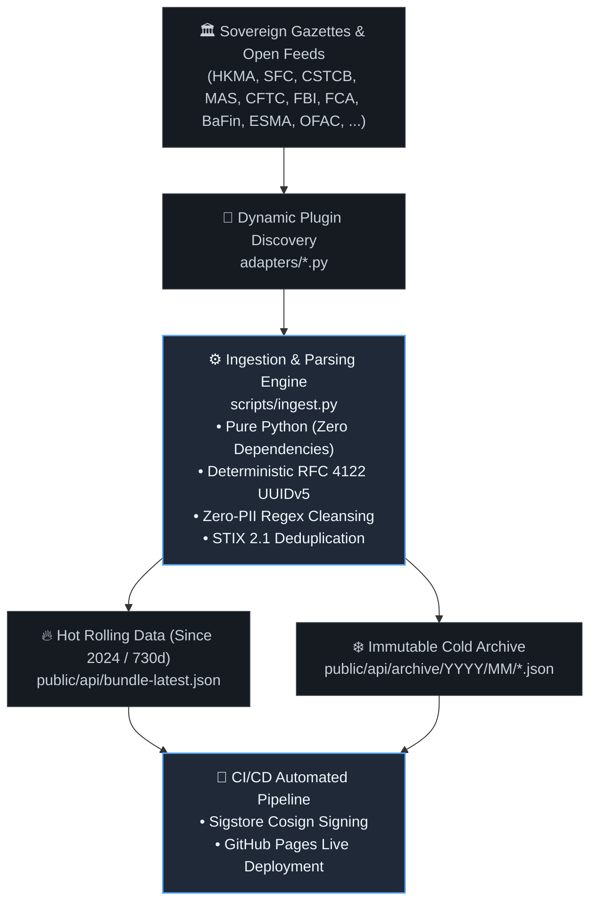

# 🛡️ Veritas | 揭偽
### Sovereign Scam & Impersonation Bulletin Mirror (STIX 2.1)
### 法定機構防偽與跨國詐騙公報結構化威脅情報鏡像

[](LICENSE)
[](https://oasis-open.github.io/cti-documentation/)
[](https://sigstore.dev/)
[](LEGAL_COMPLIANCE.md)
[](https://jackylawck.github.io/Veritas/api/bundle-latest.json)

[**🌐 Live Dashboard / 線上儀表板**](https://jackylawck.github.io/Veritas/) • [**⚖️ Legal Compliance / 法律與合規白皮書**](LEGAL_COMPLIANCE.md) • [**📦 API Endpoint / 機器端點**](https://jackylawck.github.io/Veritas/api/bundle-latest.json)

---

## 📖 Overview / 專案簡介

**Veritas (揭偽)** is an enterprise-grade, open-source, bilingual (Traditional Chinese & English) threat intelligence mirror. It continuously ingests, extracts, deduplicates, and structures high-confidence anti-fraud and entity-impersonation alerts issued directly by statutory sovereign regulators, law enforcement agencies, and global cybersecurity feeds into machine-readable **OASIS STIX 2.1** bundles.

**Veritas（「揭偽」）** 是一個企業級、開源、繁中與英文雙語的主權級網絡威脅情報鏡像帳本。系統全自動採集、提取、去重並結構化全球法定監管機構、執法單位與權威情報源發布之防詐騙、冒名金融與釣魚公報，並轉化為符合國際標準 **OASIS STIX 2.1** 規格之機讀威脅情報端點。

---

## 🏛️ Sovereign Authorities & Feed Matrix / 主權機構與情報來源矩陣

Veritas integrates 20+ statutory authorities and global detection feeds across major financial jurisdictions:

| Jurisdiction / 法域 | Authority / 機構名稱 | Domain / 涵蓋情報領域 | Confidence |
| :--- | :--- | :--- | :---: |
| 🇭🇰 **Hong Kong** | **HKMA (香港金融管理局)** | 偽冒持牌銀行、虛假網銀、詐騙應用程式 (Fraudulent Banks) | 95 |
| 🇭🇰 **Hong Kong** | **SFC (香港證券及期貨事務監察委員會)** | 無牌公司、可疑投資平台、冒名持牌券商 (Unlicensed Entities) | 95 |
| 🇭🇰 **Hong Kong** | **HKPF CSTCB (香港警務處網絡安全及科技罪案調查科)** | 防騙視伏器高危網域、電騙洗錢跳板 (Scameter High-Risk URLs) | 95 |
| 🇸🇬 **Singapore** | **MAS (新加坡金融管理局)** | 投資者警示名單 (Investor Alert List - IAL) | 95 |
| 🇹🇼 **Taiwan** | **TW NPA 165 (警政署全民防騙網)** | 詐騙網址、AI 換臉偽冒名流投資公報 (165 Anti-Fraud Feed) | 90 |
| 🇺🇸 **United States** | **CFTC (美國商品期貨交易委員會)** | RED List 跨國外匯、二元期權與加密衍生品黑名單 | 95 |
| 🇺🇸 **United States** | **FBI IC3 (聯邦調查局網絡犯罪投訴中心)** | 跨國商業電郵詐騙 (BEC)、CEO 冒名、重大網絡詐騙公報 | 95 |
| 🇺🇸 **United States** | **US OFAC (財政部外國資產控制辦公室)** | 勒索軟體洗錢、跨國網絡犯罪制裁對象 (Cyber SDN List) | 99 |
| 🇬🇧 **United Kingdom** | **UK FCA (金融行為監管局)** | 未經授權金融實體、冒名克隆持牌公司 (Clone Firms) | 95 |
| 🇪🇺 **European Union** | **ESMA (歐洲證券及市場管理局)** | 歐盟全境 27 國跨法域協調之未授權金融實體清單 | 95 |
| 🇩🇪 **Germany** | **BaFin (德國聯邦金融監管局)** | 消費者警示、無牌未受監管金融與加密服務商 (Verbraucherwarnungen) | 95 |
| 🇫🇷 **France** | **AMF (法國金融市場管理局)** | 外匯未經許可交易商、加密貨幣黑名單 (DASP Blacklist) | 95 |
| 🇨🇭 **Switzerland** | **FINMA (瑞士金融市場監督管理局)** | 偽冒瑞士私人銀行、未經核准離岸金融機構 (Warning List) | 95 |
| 🇨🇦 **Canada** | **OSC (安大略省證券委員會)** | 北美殺豬盤、未經註冊加密投資與期貨實體 | 95 |
| 🇦🇺 **Australia** | **ACCC Scamwatch (國家反詐騙中心)** | 大洋洲高危詐騙基礎設施、冒名金融機構網域 | 90 |
| 🇦🇺 **Australia** | **ASIC (澳洲證券與投資委員會)** | 投資者警示清單 (Investor Alert List / Moneysmart) | 95 |
| 🇯🇵 **Japan** | **FSA (日本金融廳)** | 無登録業者清單、假冒信託金融機構 (Unregistered Firms) | 95 |
| 🇷🇺 **Russia** | **CBR (俄羅斯聯邦中央銀行)** | 金字塔龐氏騙局、非法外匯與影子借貸名單 | 95 |
| 🇨🇳 **China** | **CAC Piyao (中央網信辦聯合闢謠平台)** | 涉企冒名商譽、官方辟謠公報、政策偽造欺詐網域 | 95 |
| 🌐 **Global** | **OpenPhish Community Feed** | 全球金融及知名品牌 0-Day 即時釣魚鏈接 (Brand Impersonation) | 90 |

---

## ⚙️ Architecture & Engineering Specs / 系統架構與工程規格



1. **Zero External Dependencies / 零外部函式庫依賴**:
Engineered using vanilla Python standard libraries (`urllib`, `re`, `json`, `hashlib`, `uuid`). Completely immune to third-party PyPI supply chain poisonings.
2. **Deterministic Idempotency / 確定性命名空間冪等性**:
Identities, Indicators, and Reports utilize RFC 4122 UUIDv5 scoped under DNS namespace `veritas.threat-intel.internal`. Repeated runs generate identical STIX IDs with zero drift.
3. **Dual-Tier Storage Model / 冷熱雙軌儲存架構**:
* **Hot Feed (`bundle-latest.json`)**: Rolling 730-day window ("Since 2024") maintaining ultra-low footprint for real-time edge security integration.
* **Cold Archive (`archive/YYYY/MM/*.json`)**: Immutable snapshots preserving historical evidentiary provenance.


4. **Cryptographic Provenance / 密碼學簽名溯源**:
Automated keyless cryptographic signing via **Sigstore Cosign** within GitHub Actions, establishing non-repudiation.

---

## ⚖️ Regulatory Compliance & Privacy Governance / 法律與合規聲明

Veritas is purposefully designed for strict global regulatory compliance. For complete legal justifications and audit defense, refer to **[LEGAL_COMPLIANCE.md](https://www.google.com/search?q=LEGAL_COMPLIANCE.md&utm_source=gemini)**:

* **EU AI Act (Regulation (EU) 2024/1689)**: **Out of Scope (Article 3(1))**. Veritas uses purely deterministic Regex and heuristic string-matching rules. It contains zero machine learning, zero statistical models, and zero generative capabilities.
* **ISO/IEC 42001:2023 (AIMS)**: Formally declared as **Non-Applicable** due to the absence of AI training and deployment.
* **Hong Kong PDPO (Cap. 486)**: **Fully Compliant**. Exclusively indexes statutory juristic entities and cyber infrastructure indicators. Strictly rejects personally identifiable information (Zero-PII).
* **EU GDPR (Regulation (EU) 2016/679)**: Excluded under **Recital 14** (legal persons are not natural persons). Technical IoCs processed under **Article 6(1)(f) and Recital 49** (Legitimate interest in sovereign cybersecurity).
* **ISO/IEC 27001 / 27701 Alignment**: Enforces data minimization, zero attack surface static delivery, and cryptographic validation.

---

## 🚀 Enterprise Integration / 企業端與 SIEM 串接指南

### Python Ingestion Example / Python 自動串接範例

```python
import json
import urllib.request

VERITAS_FEED_URL = "[https://jackylawck.github.io/Veritas/api/bundle-latest.json](https://jackylawck.github.io/Veritas/api/bundle-latest.json)"

req = urllib.request.Request(
    VERITAS_FEED_URL,
    headers={"User-Agent": "Enterprise-SOC-Ingestor/1.0"}
)

with urllib.request.urlopen(req) as resp:
    bundle = json.loads(resp.read().decode("utf-8"))

# 提取所有失陷網域 (Indicators) 與關聯報告
indicators = [obj for obj in bundle.get("objects", []) if obj.get("type") == "indicator"]
reports = [obj for obj in bundle.get("objects", []) if obj.get("type") == "report"]

print(f"[*] 成功載入 Veritas 主權情報: {len(indicators)} 個指標, {len(reports)} 份法定報告")
for ind in indicators[:5]:
    print(f"  [-] STIX Pattern: {ind['pattern']} (置信度: {ind['confidence']}%)")

```

---

## 🛠️ Local Development & Operations / 本地維護指南

### 1. Clone Repository / 複製倉庫

```bash
git clone [https://github.com/jackylawck/Veritas.git](https://github.com/jackylawck/Veritas.git)
cd Veritas

```

### 2. Run Sovereign Ingestion Engine / 執行全域採集管道

```bash
# 觸發所有 adapters 自動發現、拉取、去重與存檔封裝
python scripts/ingest.py

```

### 3. Verify Local Feeds / 檢驗資料輸出

```bash
# 查看熱資料產出
cat public/api/bundle-latest.json | head -n 30

```

### 4. Deploy Updates / 提交變更

```bash
git add README.md
git commit -m "docs: finalize enterprise bilingual README with responsive mermaid flow"
git push origin main

```

---

## 📄 License & Provenance Disclaimer / 授權與免責條款

* **Codebase**: Licensed under the [MIT License](https://www.google.com/search?q=LICENSE&utm_source=gemini).
* **Threat Data Feeds**: Distributed under sovereign open government data frameworks (Open Government Licence - Hong Kong, data.gov.sg, U.S. Public Domain, Crown Copyright, Etalab Open Licence).
* **Disclaimer**: Veritas acts as a secondary technological mirror. The information is provided "AS IS" without warranties of any kind. Maintainers assume no liability for reliance placed on sovereign notices mirrored herein. See [LEGAL_COMPLIANCE.md](https://www.google.com/search?q=LEGAL_COMPLIANCE.md&utm_source=gemini) for full Safe Harbor clauses.
